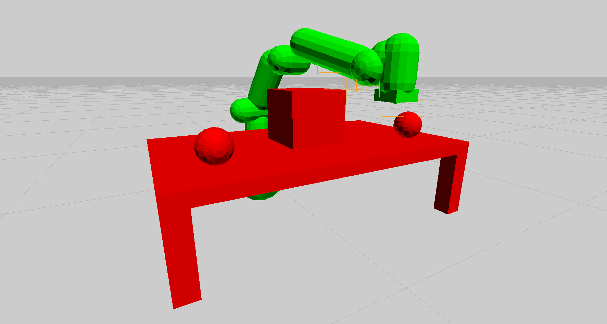

# LCPMotionPlanner
## Summary
LCPMotionPlanner is a task space motion planner with obstacle avoidance for spatial manipulators. 

The motion planning is screw linear interpolation (ScLERP) based, and the obstacle avoidance is formulated as a linear complementarity problem (LCP). The benefit of using this approach is the natural expression of task space constraints, even with collision avoidance. Additionally, this approach is much more computationally efficient than random sampling.

<p align="center">
  
</p>

## Supported Platforms
Currently, only Windows and Linux are supported. For Windows, builds have been tested on Windows 11 with MSVC 17. For Linux, builds have been tested on Ubuntu 20.04 with GCC 9.4.0.

## Documentation
To generate documentation, run doxygen using the supplied Doxyfile, and open index.html.
```bash
cd docs/doxygen
doxygen Doxyfile
cd html && firefox index.html
```

## Dependencies
LCPMotionPlanner has two dependencies, Eigen and PhysX. They are included as submodules of this repository and handled by CMake, so no extra effort is required to get started.

If you are on Linux, you may need some extra packages for PhysX. Run the below command to ensure you do not get any issues related to missing header files.

```bash
sudo apt-get install build-essential libxxf86vm-dev libgl1-mesa-dev libglu1-mesa-dev gcc-multilib g++-multilib freeglut3-dev lib32z1
```

## Build Configurations
PhysX ships with four build configurations. Prefer to use the debug or release mode as they are most stable with LCPMotionPlanner.
- "debug": Full debug build of PhysX + LCPMotionPlanner with checks and visualization.
- "checked": Release build of PhysX with checks and visualization + release build of LCPMotionPlanner with debugging.
- "profile": Release build of PhysX without chceks but still with visualization + release build of LCPMotionPlanner with debugging.
- "release": Full release build of PhysX + LCPMotionPlanner with no visualization or debugging.

## Build Instructions
Clone the repository and setup submodules.
```bash
git clone https://github.com/Tom-Forsyth/LCPMotionPlanner.git
cd LCPMotionPlanner
git submodule init
git submodule update --recursive
```

Run CMake with the desired build configuration to generate a makefile (Linux) or Visual Studio solution (Windows).
```bash
cmake -B build -DCMAKE_BUILD_TYPE=release
```

If you are on Linux, build the project using the make file, and run the simulation.
```bash
cd build
make -j20
./LCPMotionPlanner
```

If you are on Windows, open "LCPMotionPlanner.sln" inside of the build directory. Press F7 to build the solution, and run the simulation.

## Debug Visualization
Currently, debug visualization is only supported through PhysX Visual Debugger, which is only available for Windows. With PhysX Visual Debugger open, run the simulation, and the primatives of the scene will appear in the PVD player. Release builds do not support debug visualization - please use debug, checked, or profile builds.

## High Fidelity Visualization
Realistic visualation is available through UnrealSim, where we are using this module to generate collision free plans for the Franka Panda manipulator. Objects can be placed into the UnrealSim simulation scene, and the objects will then be loaded in as primatives into this library to generate and visualze a collision free plan.

## Example Simulation
An [example simulation](src/main.cpp) for the Franka Panda is provided.

## NVIDIA PhysX SDK 4.1 Redistribution Notice

Copyright (c) 2021 NVIDIA Corporation. All rights reserved.

Redistribution and use in source and binary forms, with or without
modification, are permitted provided that the following conditions
are met:
 * Redistributions of source code must retain the above copyright
   notice, this list of conditions and the following disclaimer.
 * Redistributions in binary form must reproduce the above copyright
   notice, this list of conditions and the following disclaimer in the
   documentation and/or other materials provided with the distribution.
 * Neither the name of NVIDIA CORPORATION nor the names of its
   contributors may be used to endorse or promote products derived
   from this software without specific prior written permission.

THIS SOFTWARE IS PROVIDED BY THE COPYRIGHT HOLDERS ``AS IS'' AND ANY
EXPRESS OR IMPLIED WARRANTIES, INCLUDING, BUT NOT LIMITED TO, THE
IMPLIED WARRANTIES OF MERCHANTABILITY AND FITNESS FOR A PARTICULAR
PURPOSE ARE DISCLAIMED.  IN NO EVENT SHALL THE COPYRIGHT OWNER OR
CONTRIBUTORS BE LIABLE FOR ANY DIRECT, INDIRECT, INCIDENTAL, SPECIAL,
EXEMPLARY, OR CONSEQUENTIAL DAMAGES (INCLUDING, BUT NOT LIMITED TO,
PROCUREMENT OF SUBSTITUTE GOODS OR SERVICES; LOSS OF USE, DATA, OR
PROFITS; OR BUSINESS INTERRUPTION) HOWEVER CAUSED AND ON ANY THEORY
OF LIABILITY, WHETHER IN CONTRACT, STRICT LIABILITY, OR TORT
(INCLUDING NEGLIGENCE OR OTHERWISE) ARISING IN ANY WAY OUT OF THE USE
OF THIS SOFTWARE, EVEN IF ADVISED OF THE POSSIBILITY OF SUCH DAMAGE.
